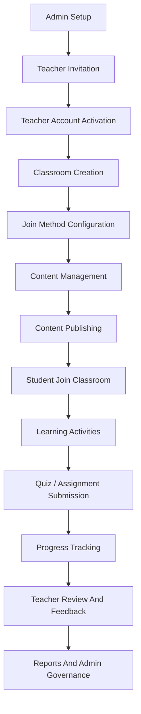

# Business Process Map Index

## Mục Đích

Tài liệu này mô tả bản đồ tổng thể các **Business Processes** của dự án **Microlearning Classroom LMS Platform**. Mục tiêu là giúp Product Owner, Business Analyst, Developer, QA và DevOps Engineer hiểu hệ thống vận hành theo luồng nghiệp vụ nào, actor nào chịu trách nhiệm, dữ liệu nào được tạo ra và các process liên kết với nhau ra sao.

Hệ thống được xây dựng theo mô hình **Internal LMS** hỗ trợ giảng dạy, trong đó:

- **Admin** quản trị người dùng, chính sách hệ thống, Teacher invitation và giám sát vận hành.
- **Teacher** tạo Classroom, tạo nội dung microlearning, giao bài, theo dõi tiến độ và đánh giá Student.
- **Student** tham gia Classroom bằng `Class Code`, `Invite Link`, học bài, làm quiz, nộp assignment và xem feedback.
- **System** kiểm soát xác thực, phân quyền, dữ liệu học tập, audit log, RESTful API, Swagger/OpenAPI, Docker, CI/CD và Cloud deployment.

## Nguyên Tắc Mô Tả Process

Mỗi process trong mục `06-business-processes` cần thể hiện rõ:

| Thành phần | Ý nghĩa |
| --- | --- |
| Process ID | Mã định danh process để trace sang requirements, use cases và test cases |
| Process Owner | Role chịu trách nhiệm chính về nghiệp vụ |
| Supporting Actors | Các actor hỗ trợ hoặc bị ảnh hưởng |
| Trigger | Sự kiện bắt đầu process |
| Preconditions | Điều kiện cần có trước khi process chạy |
| Main Flow | Luồng nghiệp vụ chuẩn |
| Alternative Flow | Luồng thay thế hợp lệ |
| Exception Flow | Luồng lỗi hoặc tình huống bất thường |
| Postconditions | Trạng thái sau khi process hoàn tất |
| Business Rules | Quy tắc nghiệp vụ kiểm soát process |
| Data Outputs | Dữ liệu được tạo hoặc cập nhật |
| UI Touchpoints | Màn hình liên quan |
| API Touchpoints | Nhóm API liên quan |
| Audit Points | Hành động cần ghi log để kiểm soát |

## End-to-End Business Process

Luồng tổng thể của sản phẩm được mô tả như sau:

```text
Admin thiết lập hệ thống
        ↓
Admin tạo Teacher invitation link
        ↓
Admin copy link và gửi thủ công cho Teacher
        ↓
Teacher kích hoạt tài khoản
        ↓
Teacher tạo Classroom
        ↓
Teacher cấu hình Class Code / Invite Link
        ↓
Teacher tạo microlearning content, quiz, assignment
        ↓
Teacher publish hoặc assign nội dung
        ↓
Student tham gia Classroom
        ↓
Student học lesson, làm quiz, nộp assignment
        ↓
System ghi nhận progress, score, submission
        ↓
Teacher xem progress dashboard, gradebook và feedback
        ↓
Admin giám sát vận hành, reports, audit và governance
```

## Mermaid Overview



## Danh Sách Business Processes

| Process ID | Process Name | Process Owner | Supporting Actors | Priority | Tài liệu |
| --- | --- | --- | --- | --- | --- |
| BP-001 | Learning Process | Student | Teacher, System | Must Have | learning-process.md |
| BP-002 | Classroom Join Process | Student | Teacher, System | Must Have | classroom-join-process.md |
| BP-003 | Teacher Invitation Process | Admin | Teacher, System | Must Have | teacher-invitation-process.md |
| BP-004 | Content Management Process | Teacher | Student, System | Must Have | content-management-process.md |
| BP-005 | Admin Operation Process | Admin | Teacher, Student, System | Must Have | admin-operation-process.md |

## Quan Hệ Giữa Các Process

| Process nguồn | Process phụ thuộc | Lý do phụ thuộc |
| --- | --- | --- |
| Admin Operation Process | Teacher Invitation Process | Admin phải tạo điều kiện để Teacher có tài khoản hợp lệ |
| Teacher Invitation Process | Content Management Process | Teacher cần account `ACTIVE` trước khi tạo Classroom và nội dung |
| Content Management Process | Classroom Join Process | Student chỉ nên join Classroom đã được Teacher tạo và mở enrollment |
| Classroom Join Process | Learning Process | Student phải thuộc classroom roster trước khi học nội dung riêng của lớp |
| Learning Process | Admin Operation Process | Dữ liệu progress, completion, score và audit được Admin dùng cho reports/governance |

## Process Ownership

| Role | Process chịu trách nhiệm chính | Trách nhiệm nghiệp vụ |
| --- | --- | --- |
| Admin | BP-003, BP-005 | Quản trị account, tạo invitation link thủ công, cấu hình policy, audit, reports và governance |
| Teacher | BP-004 | Tạo Classroom, quản lý nội dung, publish activity, theo dõi progress, chấm điểm và feedback |
| Student | BP-001, BP-002 | Tham gia Classroom, học nội dung được giao, làm quiz, nộp assignment và xem kết quả |
| System | Tất cả process | Xác thực, phân quyền, lưu dữ liệu, validate rule, ghi audit log và cung cấp RESTful API |
| DevOps Engineer | Hỗ trợ tất cả process | Đảm bảo môi trường deploy, CI/CD, Docker, monitoring và rollback giúp process chạy ổn định |

## Process Priority Cho MVP

| Priority | Process | Lý do |
| --- | --- | --- |
| P1 | Teacher Invitation Process | Không có Teacher account thì không thể vận hành lớp học |
| P1 | Classroom Join Process | Đây là điểm vào chính của Student |
| P1 | Content Management Process | Đây là năng lực lõi để Teacher tạo giá trị học tập |
| P1 | Learning Process | Đây là hành trình chính của Student |
| P1 | Admin Operation Process | Cần để quản trị user, policy, audit và support |

## Process Boundary

### In Scope

- Admin tạo Teacher invitation link và tự gửi thủ công ngoài hệ thống.
- Teacher tự kích hoạt account bằng invitation link.
- Teacher tạo Classroom, tạo nội dung microlearning, quiz, assignment và resource.
- Student tham gia Classroom bằng `Class Code`, `Invite Link`.
- Student học lesson, làm quiz, nộp assignment và nhận feedback.
- Teacher xem tiến độ học tập của từng Student và toàn lớp.
- Admin xem reports, audit log, account status và policy cấp hệ thống.

### Out Of Scope Cho MVP

- Tự động gửi email invitation bằng Gmail, SMTP, SendGrid hoặc email provider.
- Tích hợp Google Classroom API.
- Livestream, video conference hoặc live teaching.
- Payment, subscription hoặc marketplace content.
- AI grading tự động cho bài tự luận.
- Certificate engine nâng cao.
- Multi-tenant enterprise configuration phức tạp.

## DevOps Liên Quan Đến Business Process

Trong dự án này, DevOps không chỉ là phần kỹ thuật deploy, mà còn giúp đảm bảo các process nghiệp vụ chạy ổn định trên môi trường thật.

| DevOps thành phần | Liên quan business process | Cách hiểu đơn giản |
| --- | --- | --- |
| Docker | Đóng gói ReactJS, Node.js API và MongoDB config | Giúp app chạy giống nhau ở máy dev, test và cloud |
| CI/CD | Tự động build, test và deploy khi code thay đổi | Giảm lỗi khi đưa tính năng mới lên môi trường thật |
| Cloud Deployment | Đưa hệ thống lên môi trường có thể truy cập qua internet | Teacher và Student có thể sử dụng từ trình duyệt |
| Environment Variables | Quản lý secrets, API URL, database URL | Không hard-code thông tin nhạy cảm trong source code |
| Monitoring | Theo dõi lỗi API, downtime, performance | Phát hiện sớm khi Student không join được lớp hoặc Teacher không mở được dashboard |
| Backup | Sao lưu dữ liệu MongoDB | Giảm rủi ro mất classroom, submission và progress |
| Rollback | Quay lại version ổn định khi release lỗi | Bảo vệ trải nghiệm học tập khi deploy gặp sự cố |

## Traceability Gợi Ý

| Process ID | Requirements liên quan | Use Case liên quan | Test Scenarios liên quan |
| --- | --- | --- | --- |
| BP-001 | Student learning, progress tracking, quiz, assignment | Student learns lesson, Student takes quiz, Student submits assignment | Learning flow, progress update, score calculation |
| BP-002 | Join by Class Code / Invite Link | Student joins Classroom | Valid join, invalid code, expired link, duplicate Enrollment |
| BP-003 | Teacher invitation, manual copy link, account activation | Admin invites Teacher, Teacher activates account | Create invitation, copy link, accept token, expired/revoked token |
| BP-004 | Classroom management, content authoring, publish content | Teacher creates classroom/content | Draft content, publish content, assign lesson, edit content |
| BP-005 | User management, role management, audit, reporting | Admin manages users/policy | Account status update, role update, audit log, offboarding |

## Tiêu Chí Hoàn Thành Mục 06

Mục `06-business-processes` được xem là đủ cho BA baseline khi:

- Tất cả process Must Have đã có tài liệu riêng.
- Mỗi process có main flow, alternative flow và exception flow.
- Business rules được mô tả đủ rõ để Developer triển khai và QA viết test case.
- Mỗi process có output dữ liệu, API touchpoints và UI touchpoints.
- Các quyết định nghiệp vụ quan trọng được thể hiện nhất quán, đặc biệt là `Teacher invitation = MANUAL_COPY`.
- DevOps touchpoints được giải thích ở mức dễ hiểu để phục vụ mục tiêu học DevOps của dự án.
