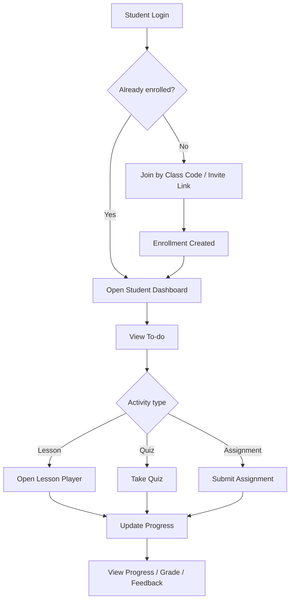
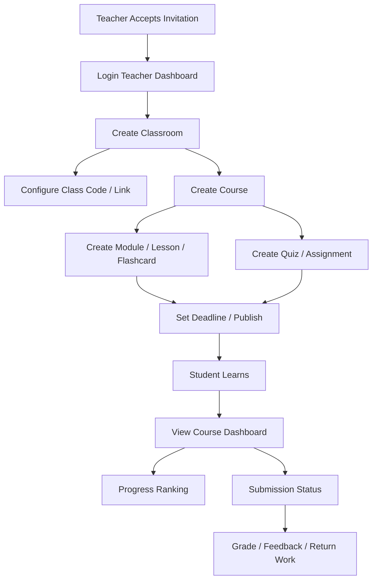
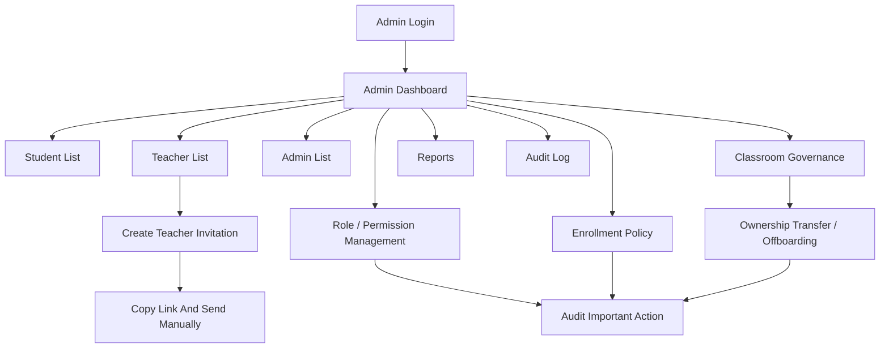

# Use Case Diagram

## Mục Đích

Tài liệu này cung cấp góc nhìn use case cấp cao cho **Microlearning Classroom LMS Platform**. Sơ đồ tập trung vào actor chính và nhóm use case lớn, không thay thế cho catalog/specification chi tiết.

## Use Case Diagram Cấp Cao

```mermaid
flowchart LR
  Guest["Guest"]
  User["User"]
  Student["Student"]
  Teacher["Teacher"]
  Admin["Admin"]
  SuperAdmin["Super Admin"]
  DevQA["Developer / QA"]
  DevOps["DevOps Engineer"]
  System["System"]

  Auth["Login / Register / Reset Password"]
  Profile["Profile / Session / Route Guard"]

  Join["Join Classroom by Code / Link"]
  Todo["Student Dashboard / To-do"]
  Learn["Lesson / Flashcard / Resource"]
  Quiz["Take Quiz"]
  Submit["Submit Assignment"]
  StudentProgress["View Progress / Grade / Feedback"]

  Classroom["Create / Manage Classroom"]
  JoinMethods["Class Code / Invite Link"]
  Course["Course / Module / Lesson"]
  Assessment["Quiz / Assignment / Question Media"]
  Grade["Submission / Grading / Feedback"]
  TeacherProgress["Course Dashboard / Progress Ranking / Gradebook"]

  AdminDashboard["Admin Dashboard"]
  UserLists["Student List / Teacher List / Admin List"]
  Invitation["Teacher Invitation Manual Copy Link"]
  Policy["Enrollment / File / Notification Policy"]
  Governance["Classroom Governance / Ownership / Offboarding"]
  Reports["Reports / Audit Log / Export"]
  Settings["System Settings"]

  API["RESTful API / Swagger / Error Standard"]
  DevOpsFlow["Docker / CI-CD / Cloud / Monitoring / Backup / Rollback"]
  Audit["Audit Important Actions"]

  Guest --> Auth
  Guest --> Join
  User --> Profile

  Student --> Join
  Student --> Todo
  Student --> Learn
  Student --> Quiz
  Student --> Submit
  Student --> StudentProgress

  Teacher --> Classroom
  Teacher --> JoinMethods
  Teacher --> Course
  Teacher --> Assessment
  Teacher --> Grade
  Teacher --> TeacherProgress

  Admin --> AdminDashboard
  Admin --> UserLists
  Admin --> Invitation
  Admin --> Policy
  Admin --> Governance
  Admin --> Reports
  SuperAdmin --> Settings

  DevQA --> API
  DevOps --> DevOpsFlow
  System --> Audit
  Admin --> Audit
```

## Student Use Case Flow

## Teacher Use Case Flow

## Admin Use Case Flow

