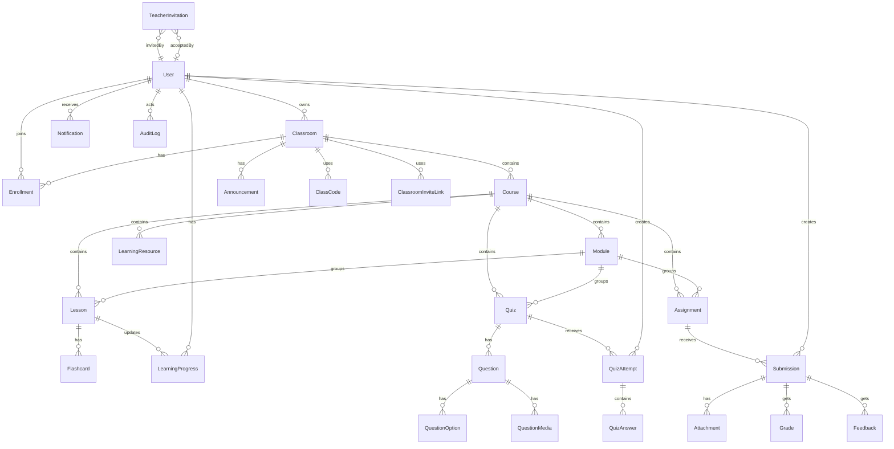

# Data Relationship Map

## Mục Đích

Tài liệu này mô tả quan hệ dữ liệu cấp cao giữa các entity chính trong hệ thống **Microlearning Classroom LMS Platform**. Vì hệ thống dùng MongoDB, đây không phải ERD quan hệ cứng như SQL, nhưng vẫn cần hiểu ownership, reference và luồng dữ liệu để thiết kế collection, API và test đúng.

## Relationship Overview

## Quan Hệ Theo Domain

### Identity & Access

| Quan hệ | Cardinality | Mô tả |
| --- | --- | --- |
| User - Role | N-1 hoặc N-N | MVP có thể một user một role chính; Post-MVP có thể nhiều role |
| Role - Permission | N-N | Role có nhiều permission |
| User - UserSession | 1-N | Một user có thể có nhiều session/token nếu hỗ trợ |
| User - PasswordResetToken | 1-N | Token reset password có expiry và one-time use |

### Teacher Invitation

| Quan hệ | Cardinality | Mô tả |
| --- | --- | --- |
| Admin User - TeacherInvitation | 1-N | Admin tạo nhiều invitation |
| TeacherInvitation - Teacher User | 0..1 | Sau khi accept mới có `acceptedBy` |
| TeacherInvitation - AuditLog | 1-N | Create/copy/revoke/accept có thể được audit |

### Classroom & Enrollment

| Quan hệ | Cardinality | Mô tả |
| --- | --- | --- |
| Teacher User - Classroom | 1-N | Teacher sở hữu nhiều Classroom |
| Classroom - Enrollment | 1-N | Classroom có nhiều Student enrollment |
| Student User - Enrollment | 1-N | Student tham gia nhiều Classroom |
| Classroom - ClassCode | 1-N lịch sử | Mỗi thời điểm thường chỉ có một active code |
| Classroom - ClassroomInviteLink | 1-N | Có thể regenerate/disable link |

### Course & Content

| Quan hệ | Cardinality | Mô tả |
| --- | --- | --- |
| Classroom - Course | 1-N | Classroom chứa nhiều Course |
| Course - Module | 1-N | Course có nhiều Module/Topic |
| Course - Lesson/Quiz/Assignment/Resource | 1-N | Activity thuộc Course |
| Module - Activity | 1-N | Module gom Lesson/Quiz/Assignment/Resource |
| Lesson - Flashcard | 1-N | Lesson có nhiều Flashcard |

### Assessment & Submission

| Quan hệ | Cardinality | Mô tả |
| --- | --- | --- |
| Quiz - Question | 1-N | Quiz có nhiều câu hỏi |
| Question - QuestionOption | 1-N | Choice question có options |
| Question - QuestionMedia | 0-N | Question có thể có image/video optional |
| Student User - QuizAttempt | 1-N | Student có attempt theo Quiz |
| QuizAttempt - QuizAnswer | 1-N | Attempt lưu câu trả lời |
| Assignment - Submission | 1-N | Mỗi Student thường một active submission, có thể có revision history |
| Submission - Grade/Feedback | 1-N hoặc 1-1 | MVP có thể một grade/feedback hiện tại |

### Progress & Reporting

| Quan hệ | Cardinality | Mô tả |
| --- | --- | --- |
| Student User - LearningProgress | 1-N | Progress theo activity |
| Course - CourseProgressSummary | 1-N | Summary theo Student trong Course |
| Student User - StudentTodoItem | 1-N read model | To-do tổng hợp từ activity chưa hoàn thành |
| Activity - LearningProgress | 1-N | Activity có progress của nhiều Student |
| AuditLog - Resource | N-1 logical | AuditLog lưu `resourceType` và `resourceId` |

## Source Of Truth

| Dữ liệu hiển thị | Source chính | Có thể có read model |
| --- | --- | --- |
| Classroom roster | Enrollment | Classroom roster view |
| Student To-do | Lesson/Quiz/Assignment + Progress + Deadline | StudentTodoItem |
| Teacher Course Dashboard | Course + Activities + Enrollment + Progress | CourseProgressSummary |
| Progress Ranking | LearningProgress + Grade/Quiz/Submission | CourseProgressSummary |
| Admin Student List | User + Enrollment summary | User summary fields |
| Admin Teacher List | User + Classroom/Course count + Invitation | Teacher summary fields |
| Reports | Operational collections | ReportSnapshot |

## Reference Vs Embedding Guidance

| Trường hợp | Nên dùng | Lý do |
| --- | --- | --- |
| User reference trong Classroom/Course | Reference `userId` | User thay đổi profile, không muốn duplicate |
| Question options | Embed hoặc collection riêng | Options nhỏ, thường đọc cùng Question |
| Question media | Collection riêng hoặc embedded metadata | Media có validation/access control riêng |
| Audit metadata | Embed object | Metadata gắn với event, không query quan hệ sâu |
| Attachment metadata | Embed trong Submission/Resource hoặc collection riêng | Tùy cần reuse/search |
| CourseProgressSummary | Collection riêng | Cần query/sort nhanh cho dashboard |
| StudentTodoItem | Read model optional | Cần dashboard nhanh nếu dữ liệu lớn |

## Data Consistency Rules

| Rule ID | Rule |
| --- | --- |
| DREL-001 | Một Student không được có nhiều Enrollment active trong cùng Classroom. |
| DREL-002 | Course phải thuộc một Classroom tồn tại. |
| DREL-003 | Lesson/Quiz/Assignment phải thuộc Course tồn tại và Teacher có quyền quản lý Course đó. |
| DREL-004 | Submission phải thuộc Assignment tồn tại và Student phải enroll Classroom liên quan. |
| DREL-005 | QuizAttempt phải thuộc Quiz publish/assigned và Student có quyền làm Quiz. |
| DREL-006 | Grade/Feedback chỉ được tạo cho Submission/QuizAttempt hợp lệ. |
| DREL-007 | QuestionMedia không được truy cập nếu user không có quyền truy cập Question/Quiz cha. |
| DREL-008 | AuditLog phải giữ được `actorId`, `action`, `resourceType`, `resourceId`, `createdAt`. |
| DREL-009 | CourseProgressSummary có thể rebuild từ source data nếu bị lệch. |
| DREL-010 | StudentTodoItem nếu là read model phải được cập nhật khi activity publish, deadline đổi/reset hoặc progress thay đổi. |
