# User Flow Map

## Mục Đích

Tài liệu này mô tả các user flow chính của hệ thống theo từng role. Các flow này là cơ sở để:

- Frontend Developer xây dựng routing và navigation.
- Backend Developer kiểm tra API sequence cần hỗ trợ.
- QA Engineer viết test scenario và UAT flow.
- DevOps Engineer xây dựng smoke test sau deployment.

## Flow 00 - Student Tự Đăng Ký Trước Khi Login

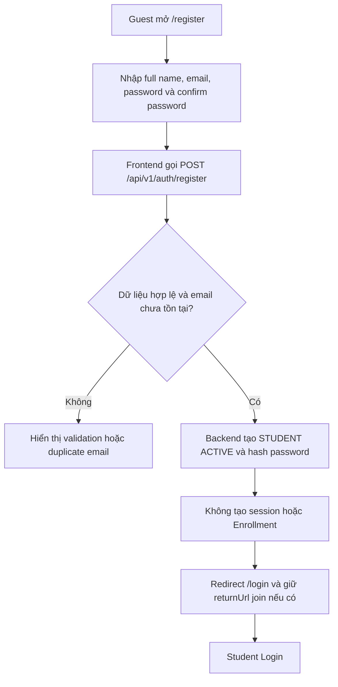

### Yêu Cầu Chính

- Frontend không gửi hoặc tin cậy field `role`/`status`; backend phải dùng field allowlist và gán cố định `STUDENT`/`ACTIVE`.
- Registration thành công không được xem là Login thành công.
- Nếu bắt đầu từ Invite Link, chỉ giữ return context; sau Login phải validate lại join token và policy.

## Flow 01 - Login Và Redirect Theo Role

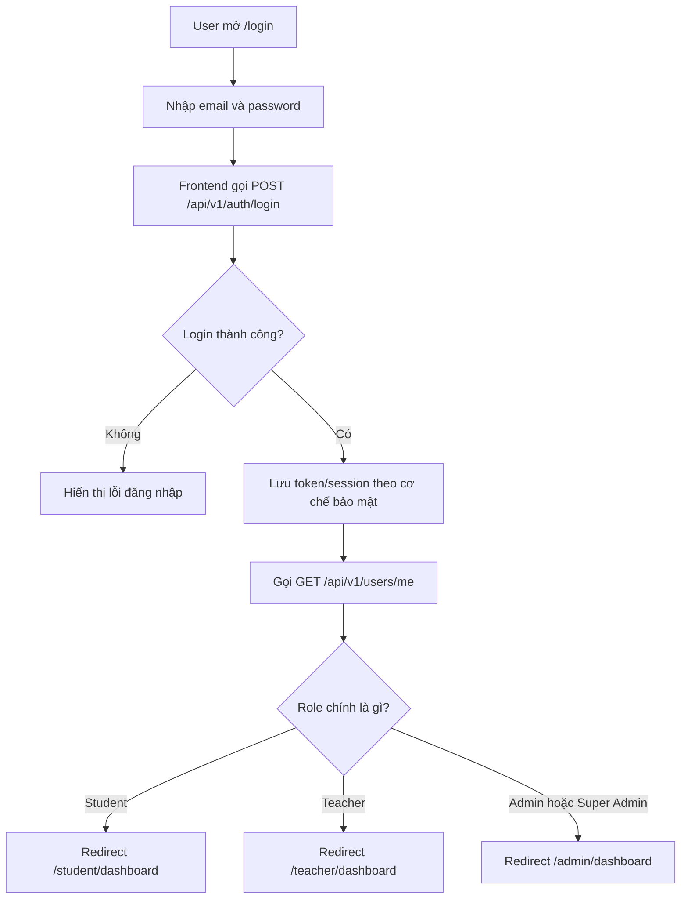

### Yêu Cầu Chính

- Không redirect theo role hard-code từ form login nếu chưa có profile/role hợp lệ.
- Nếu account có status khác `ACTIVE`, UI phải hiển thị thông báo phù hợp.
- Nếu token hết hạn, hệ thống thử `POST /api/v1/auth/refresh-token` trước khi logout.

## Flow 02 - Admin Tạo Teacher Invitation Link Thủ Công

Đây là flow đã được chọn cho dự án: hệ thống tạo link mời, Admin tự copy link và gửi thủ công qua email cá nhân, Zalo, Facebook, Messenger hoặc kênh phù hợp khác.

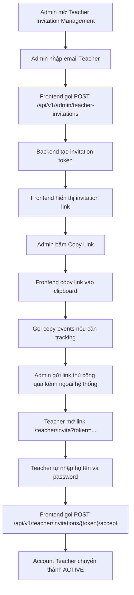

### Yêu Cầu Chính

- Admin cần nhập email để hệ thống biết invitation dành cho ai, kiểm tra trùng lặp và audit.
- Hệ thống không tự gửi email trong MVP.
- Admin không được biết password của Teacher.
- Link mời cần có trạng thái: `PENDING`, `ACCEPTED`, `EXPIRED`, `REVOKED`.
- Nếu Admin revoke link, Teacher mở link phải thấy token không còn hợp lệ.

## Flow 03 - Student Tham Gia Classroom Bằng Class Code

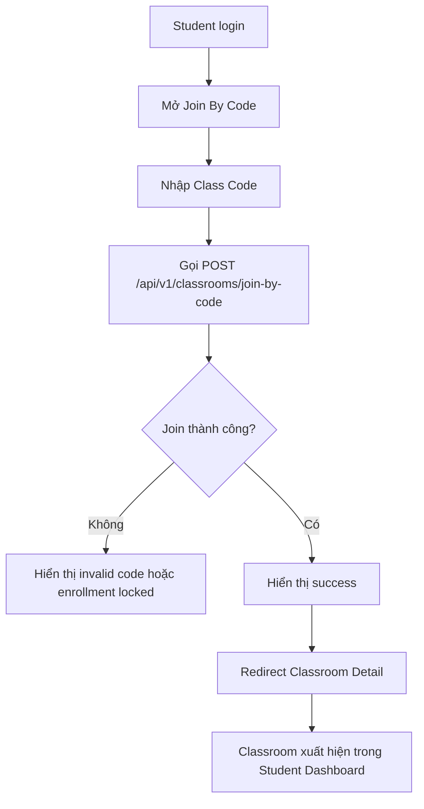

### Yêu Cầu Chính

- Nếu Student đã tham gia Classroom, UI phải báo rõ `already joined`.
- Nếu Classroom bị khóa enrollment, UI phải báo không thể tham gia.
- Sau khi join thành công, To-do và Classroom list phải được refetch.

## Flow 04 - Student Tham Gia Classroom Bằng Invite Link

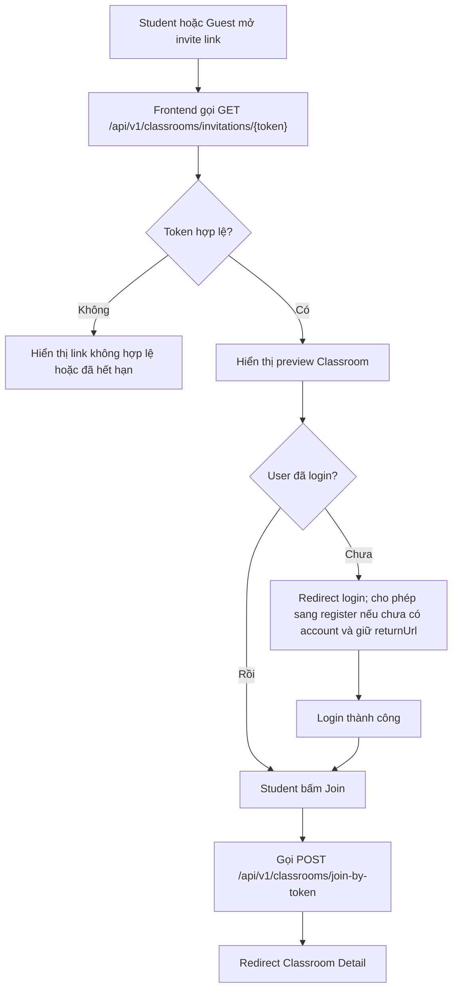

### Yêu Cầu Chính

- Guest có thể preview thông tin cơ bản nếu policy cho phép, nhưng chỉ Student đã login mới join chính thức.
- Nếu chưa có account, Guest có thể Register nhưng vẫn phải Login trước khi quay lại đúng link mời ban đầu.

## Flow 05 - Student Học Từ To-do Đến Hoàn Thành Activity

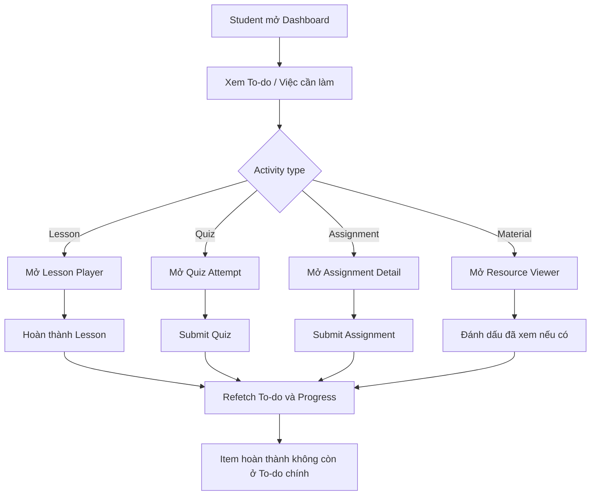

### Yêu Cầu Chính

- To-do item phải mở đúng activity theo `actionUrl` hoặc metadata từ API.
- Khi mở activity từ To-do, màn hình con phải có `Back to To-do`.
- Deadline và trạng thái `MISSING`, `LATE`, `IN_PROGRESS` phải hiển thị rõ.

## Flow 06 - Teacher Tạo Classroom Mới

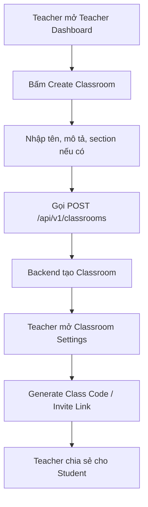

### Yêu Cầu Chính

- Form tạo Classroom cần validation tên Classroom.
- Sau khi tạo thành công, Teacher phải được đưa vào Classroom Detail hoặc Settings.
- Teacher có thể tạo Class Code và Invite Link để Student tham gia.

## Flow 07 - Teacher Tạo Course Và Nội Dung Microlearning

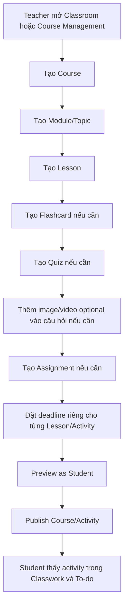

### Yêu Cầu Chính

- Teacher có thể lưu draft trước khi publish.
- Activity chưa publish chỉ Teacher thấy.
- Deadline từng Lesson/Quiz/Assignment phải đồng bộ sang Student To-do và Calendar.
- Nếu phát sinh ngoại lệ, Teacher có thể reset deadline của từng Lesson và nhập lý do thay đổi.
- Quiz Question Media là optional, câu hỏi không có media vẫn hợp lệ.

## Flow 08 - Teacher Theo Dõi Tiến Độ Course

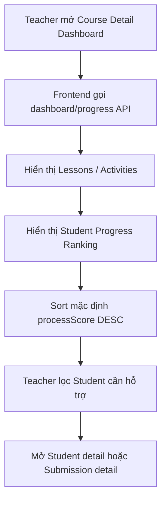

### Yêu Cầu Chính

- Teacher nhìn thấy toàn bộ bài học đã tạo khi vào Course.
- Danh sách Student progress phải sắp xếp từ điểm quá trình cao xuống thấp theo mặc định.
- Các trạng thái missing/late cần nổi bật để Teacher phát hiện Student cần hỗ trợ.

## Flow 09 - Admin Quản Lý User Theo Danh Sách Riêng

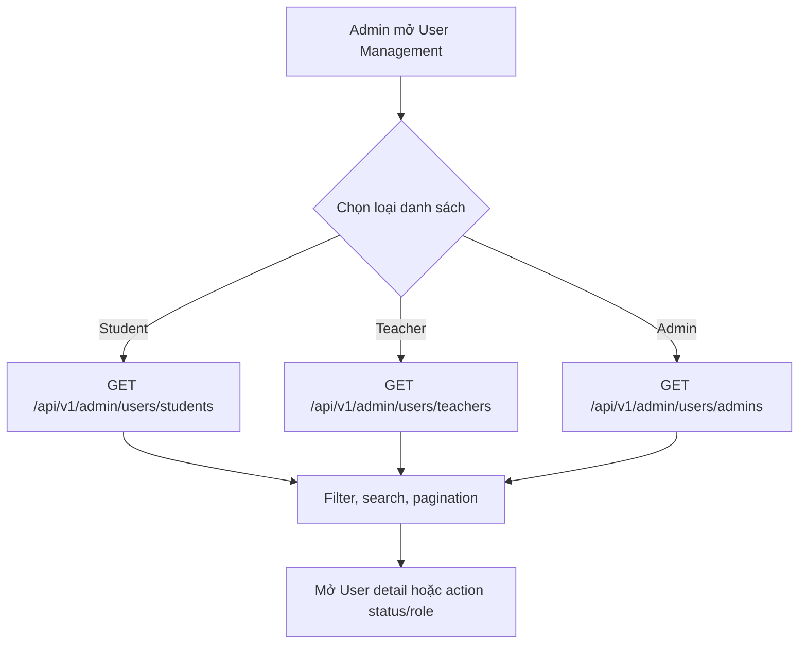

### Yêu Cầu Chính

- Không dùng một danh sách mặc định tải toàn bộ Student, Teacher và Admin cùng lúc.
- Mỗi list có filter và pagination riêng.
- Action đổi status/role cần confirm và audit log ở backend.

## Flow 10 - DevOps Deployment Smoke Test

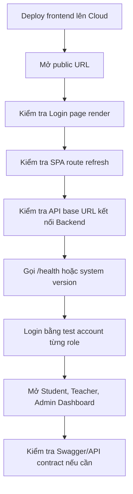

### Yêu Cầu Chính

- Refresh trực tiếp route `/student/dashboard`, `/teacher/dashboard`, `/admin/dashboard` không được bị web server 404.
- Environment variable như API base URL phải đúng với môi trường deploy.
- Frontend build version phải trace được với commit/version được deploy.

## Exception Flows Chung

| Trường hợp | UI phải xử lý |
| --- | --- |
| API trả 401 | Thử refresh token; nếu thất bại thì logout và redirect login. |
| API trả 403 | Hiển thị Forbidden page. |
| API trả 404 | Hiển thị Not Found hoặc entity not found state. |
| API trả 409 | Hiển thị conflict rõ ràng, ví dụ already joined hoặc invitation already accepted. |
| Network error | Hiển thị retry và không xóa dữ liệu đã hiển thị nếu có thể giữ cache an toàn. |
| Validation error | Hiển thị lỗi tại field tương ứng. |
| User rời editor khi chưa lưu | Hiển thị confirm unsaved changes. |
